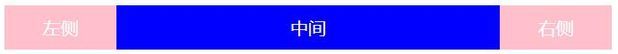
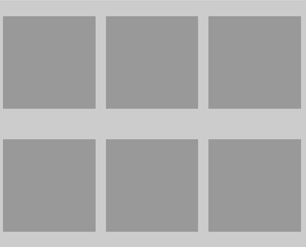

# 每日作业-移动端第二天

### 训练案例1

#### 训练描述

如下图：



利用flex布局实现，左右两侧宽度100px固定，中间宽度根据屏幕宽度自适应

要求：

​    （1）：使用flex布局方式

​    （2）：不允许使用margin、padding等方式实现

​    （3）：不允许使用定位实现

#### 训练提示

1、首先外面套个大盒子；设置宽、高并且开启flex布局

2、子盒子结构基本分为三部分左侧、中间、右侧

左侧：

宽高固定

右侧：

宽高固定

中间：

利用flex属性占据剩余空间即可


#### 操作步骤

html代码

```
<div class="main">
  <div class="box1">
  	左侧
  </div>
  <div class="box2">
  	中间
  </div>
  <div class="box3">
  	右侧
  </div>
</div>
```

css代码

```
  .main{
    width:100%;
    height:40px;
    background: #999;
    display: flex;
    color: #fff;
    line-height: 40px;
    text-align: center;
  }
  .main .box1,.main .box3{
    width:100px;
    height:40px;
    background: pink;
  }
  .main .box2{
    flex:1;
    height:100%;
    background: blue;
  }
```


### 训练案例2

####训练描述

一父盒子宽度400px,高度400px，内嵌100*100的子盒子，现要求将子盒子，在父盒子的容器内，上下左右居中

要求：必须使用flex实现，不能使用cs3或者定位

#### 训练提示

1、父盒子开启flex布局

2、子盒子设置宽高

3、如果想让子盒子上下左右全部居中那么就要设置父盒子的主轴和侧轴让子盒子居中

4、justify-content: center;主轴居中

5、align-items: center;侧轴居中

#### 操作步骤

html代码

```
<div class="box">
    <div class="childrenBox">

    </div>
</div>
```

css代码

```
  .box{
    width:400px;
    height:400px;
    background: #666;
    display: flex;
    // 主轴居中
    justify-content: center;
    //  侧轴居中
    align-items: center;
    border-radius:100px;
  }
  .childrenBox{
    width:100px;
    height:100px;
    background: #999;
  }
```

### 训练案例3

#### 训练描述

如图：



父盒子宽500，高400，父盒子内部有6个子盒子，宽高为150*150，先需求为，将子盒子一排3个显示两排，并且子盒子的左右间距相等，上下间距相等

要求：必须使用flex布局实现，不得使用margin或padding撑开间距，不得使用浮动

#### 训练提示

父盒子开启display：flex后，默认为不换行，所以使用flex-wrap：wrap；使其换行

使用justify-content: space-around; 使其子盒子主轴间距平均分配

使用align-content: space-around; 使其子盒子侧轴间距平均分配

#### 操作步骤

html代码

```
<ul class="box">
      <li></li>
      <li></li>
      <li></li>
      <li></li>
      <li></li>
      <li></li>
</ul>
```

css代码

```
  .box{
    width:500px;
    height:400px;
    background: #ccc;
    display: flex;
    list-style: none;
    display: flex;
    // 换行显示
    flex-wrap: wrap;
    // 设置主轴 间距平均分配
    justify-content: space-around;
    // 设置侧轴 间距平均分配
    align-content: space-around;
    
  }
  .box li{
    width:150px;
    height:150px;
    background: #999;
  }
```


